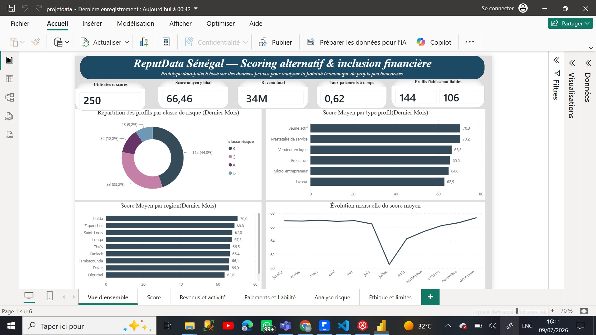
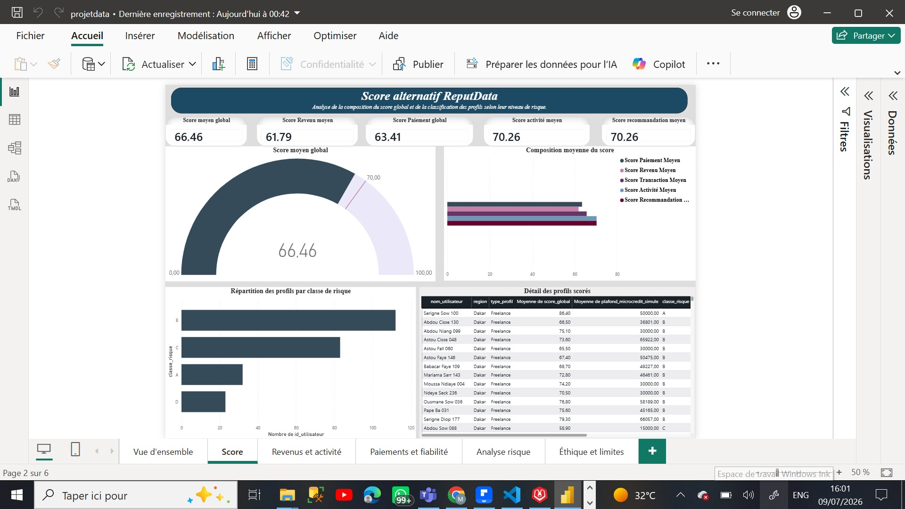
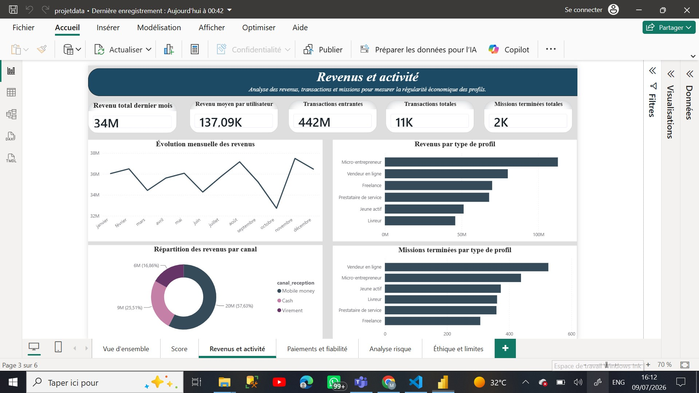
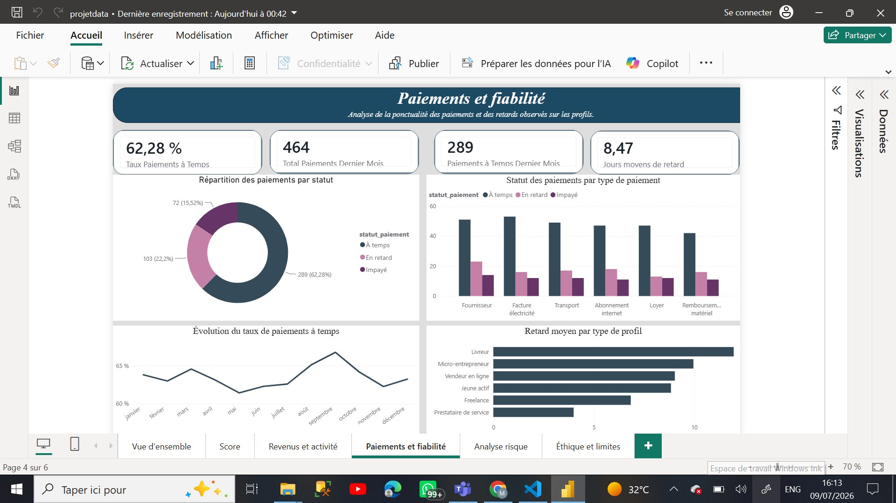
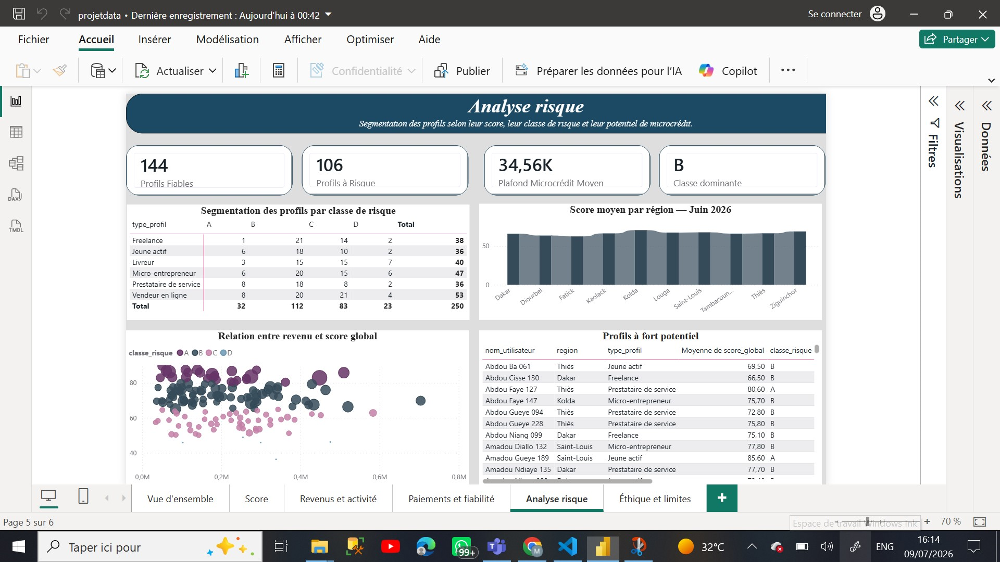
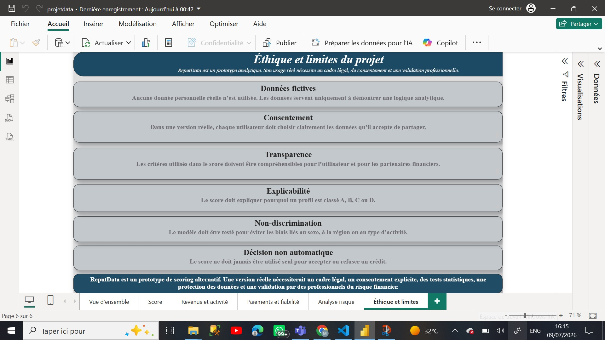

# 🇸🇳 ReputData Sénégal - Scoring alternatif & inclusion financière


## 📌 Présentation du projet

**ReputData Sénégal** est un prototype analytique développé sous **Power BI**. Il explore comment utiliser des données économiques alternatives pour construire un **score de fiabilité** destiné aux profils peu bancarisés.

### Public cible
* **Freelances** & travailleurs indépendants.
* **Vendeurs en ligne** sur les réseaux sociaux.
* **Livreurs** & acteurs de la Gig Economy.
* **Micro-entrepreneurs** du secteur informel.

> ⚠️ **Note importante** : L’objectif n'est pas de remplacer une décision bancaire, mais de proposer un outil d’aide à l’analyse pour une fintech, une microfinance (IMF) ou une structure d'inclusion financière.

---

## 🔍 Problématique & Solution

### Le constat
De nombreux profils actifs restent exclus du système bancaire classique par manque de :
* **Fiche de paie** stable.
* **Historique de crédit** ou bancaire complet.
* **Preuves financières** centralisées.

### La réponse ReputData
Centraliser et valoriser les signaux économiques dispersés pour générer des indicateurs lisibles :
* **Régularité** des revenus mensuels.
* **Ponctualité** des paiements & factures.
* **Stabilité** de l'activité & volume de missions.
* **Satisfaction** via les recommandations clients.

---

## 📊 Données & Modélisation

> 💡 *Les données utilisées dans ce projet sont entièrement fictives et générées à des fins de démonstration pour ce portfolio.*

### Architecture des tables

| Table | Description |
| :--- | :--- |
| `utilisateurs_reputdata` | Données démographiques et profils généraux. |
| `revenus_reputdata` | Sources, canaux d'encaissement et montants. |
| `paiements_reputdata` | Historique de paiement, statuts et retards. |
| `missions_reputdata` | Volume de missions et notes de satisfaction client. |
| `transactions_reputdata` | Flux financiers (entrées, sorties, catégories). |
| `scores_reputdata` | Calculs des sous-scores, score global et classes. |

### Schéma du modèle relationnel (Modèle en étoile)
Le modèle repose sur une table de dimension centrale reliée en `1 à plusieurs` (1:N) via la clé principale **`id_utilisateur`** :

```text
       [ revenus_reputdata ]
                 ↑ (N)
                 |
[ utilisateurs_reputdata ] (1) ───→ [ paiements_reputdata ] (N)
                 |
                 ├───→ [ missions_reputdata ] (N)
                 ├───→ [ transactions_reputdata ] (N)
                 └───→ [ scores_reputdata ] (N)
```

---

## 🧮 Logique du Score Alternatif

Le score final est calculé sur **100 points** selon la pondération suivante :

```text
🎨 Complétude profil [5%]
⏳ Ancienneté [10%]
⭐️ Recommandations [10%]
📈 Volume Transactions [15%]
💼 Stabilité Activité [15%]
⏱ Ponctualité Paiements [20%]
💰 Régularité Revenus [25%]
```

### Segmentation des classes de risque

* **Classe A (80 - 100 pts)** : Profil très fiable. Risque minime.
* **Classe B (65 - 79 pts)** : Profil fiable. Comportement stable.
* **Classe C (50 - 64 pts)** : Profil moyen. Analyse approfondie requise.
* **Classe D (0 - 49 pts)** : Profil fragile ou insuffisamment documenté.

---

## 🖥️ Structure du Dashboard Power BI

Le rapport visuel est structuré en **6 pages complémentaires** :

1. **Vue d’ensemble** : KPI macro (profils, score moyen, volume financier).
2. **Score alternatif** : Décomposition transparente des critères du score.
3. **Revenus et activité** : Analyse des flux financiers et des missions.
4. **Paiements et fiabilité** : Suivi des comportements de paiement et retards.
5. **Analyse risque** : Matrice de segmentation pour identifier les hauts potentiels.
6. **Éthique et limites** : Focus sur le consentement et la non-discrimination.

---

## 📈 Résultats Clés du Prototype

* **Profils analysés** : 250 utilisateurs
* **Score moyen global** : 66,46 / 100
* **Répartition Fiable (A+B)** : 144 profils
* **Classe dominante** : Classe B
* **Taux de paiements à temps** : ~62 %
* **Volume financier mensuel** : ~34,27 M FCFA

---

## 🛠️ Stack Technique

* **Modélisation** : Power BI Desktop, Power Query
* **Langages** : DAX (Mesures calculées), SQL (Analyses exploratoires)
* **Stockage** : Fichiers plats (CSV / Excel)

---

## 🗂️ Structure du Dépôt

```text
ReputData-Senegal-Scoring-Alternatif/
├── README.md
├── 1_data/                                       # Jeux de données fictifs
│   ├── utilisateurs_reputdata.csv
│   ├── revenus_reputdata.csv
│   ├── paiements_reputdata.csv
│   ├── transactions_reputdata.csv
│   ├── missions_reputdata.csv
│   └── scores_reputdata.csv
│
├── 2_sql/                                        # Scripts de validation
│   └── requetes_analyse_reputdata.sql
├── 3_powerbi/                                        # dashbord
│   └── projetdata.pbix
│
└── 4_maquettes/                                # Visuels du dashboard
    ├── page1_vue_ensemble.png
    ├── page2_score_alternatif.png
    ├── page3_revenus_activite.png
    ├── page4_paiements_fiabilite.png
    ├── page5_analyse_risque.png
    └── page6_ethique_limites.png
├── 5_documentation/
│   └── ReputData_Senegal_Presentation_GitHub.pdf
```

---

## 📸 Aperçu du Dashboard

| Page 1 : Vue d'ensemble | Page 2 : Score Alternatif |
|---|---|
|  |  |

| Page 3 : Revenus & Activité | Page 4 : Paiements & Fiabilité |
|---|---|
|  |  |

| Page 5 : Analyse Risque | Page 6 : Éthique & Limites |
|---|---|
|  |  |

---

## 🛑 Limites & Perspectives

### Limites actuelles
* **Données simulées** : Pas de confrontation au comportement réel du marché.
* **Absence de modèle prédictif** : Score basé sur des règles expertes (DAX) et non sur du Machine Learning.
* **Cadre légal** : Nécessite une conformité stricte avec la protection des données personnelles (ex: CDP au Sénégal).

### Évolutions prévues
* **Machine Learning** : Intégration d'un modèle de prédiction du défaut avec Python (`scikit-learn`).
* **Analyse de biais** : Audit algorithmique pour éviter les discriminations (genre, région).
* **Simulation** : Ajout d'un module d'octroi de microcrédit fictif en temps réel.
